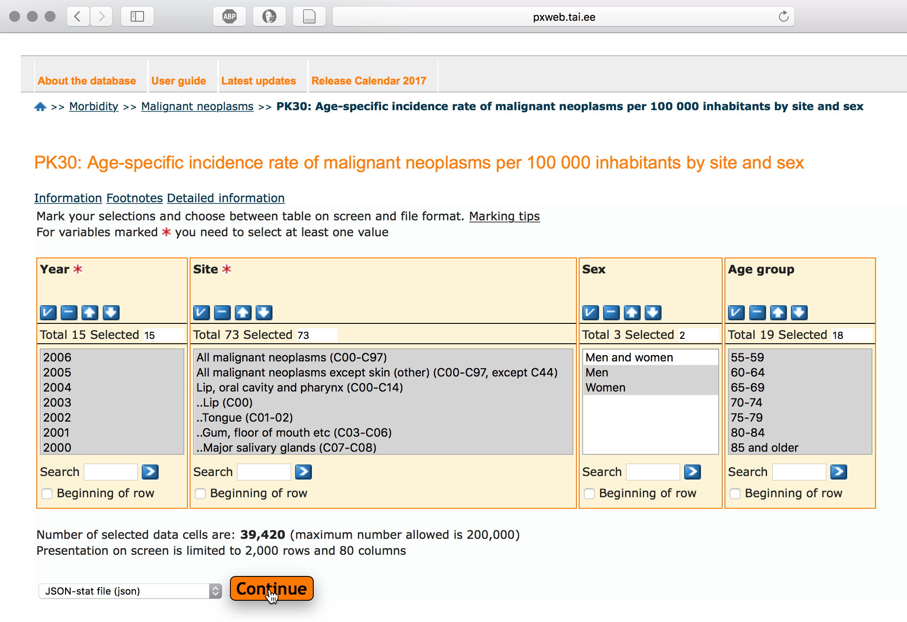

```{r setup, include=FALSE}
knitr::opts_chunk$set(echo = TRUE)
```

## Introduction

Cancer and specially lung cancer is becoming one of the leading causes of mortality.
In year 2012. cancer claimed 8.2 million lives worldwide, European Union had 15% share (1.27 million).
Most cancer deaths are caused by lung-, liver-, stomach-, colorectal-, and breast cancer. 
Most frequent cancer types are different in females and males.
Predictions show that cancer incidence increases from 14 million in 2012. to 22 million in 2030-ties.

Vähkkasvajad on maailmas üks juhtivatest surma põhjustatavatest haigustest, nõudes 8.2 miljonit elu 2012. aastal, sealhulgas on EU-27 osakaal 2012. aastal 1.27 miljonit ehk 15%.
Kopsu-, maksa-, mao-, kolorektaal- ja rinnakasvajad põhjustavad enim vähisurmasid.
Sagedasemad vähitüübid on naistel ja meestel erinevad.
Ennustatakse et haigestumus suureneb maailmas 14 miljonilt 2012. aastal 22 miljonini 2030-ndatel.


<br>

## EDA
Exploratory data analysis is iterative process [@wickham2017r] where you:

1. Generate questions about your data.

2. Search for answers by visualising, transforming, and modelling your data.

3. Use what you learn to refine your questions and/or generate new questions.

Andmeanalüüs on iteratiivne protsess, kus:

1. Esitatakse esialgsed küsimused millele soovitakse antud andmete põhjal vastuseid;

2. Proovitakse neile küsimustele vastuseid leida, kasutades andmete visualiseerimit, transformeerimist ja modelleerimist;

3. Andmete põhjal saadud uute teadmiste najal täpsustatakse esitatavaid küsimusi ja tekivad uued küsimused [@wickham2017r].

## Questions
By using cancer incidence data from Estonian Cancer Registry we want to understand:

1. What is the cancer incidence trend in Estonia?

2. What are the most frequent cancer sites?

3. What is the most frequent cancer type in men and in women?

<br>


> However, when doing data analysis 80% of time will be spent on data munging where you also become familiar with your dataset. So it's time well spent.


## Cancer incidence data from Estonian cancer registry
Estonian cancer registry data is available via [Health statistics and health research database]( http://pxweb.tai.ee/PXWeb2015/pxweb/en/02Haigestumus/02Haigestumus__04Pahaloomulised%20kasvajad/?tablelist=true&rxid=279523e2-1ea1-4a02-920b-f85bb19a908d).
We are using cancer incidence dataset from table "PK30: Age-specific incidence rate of malignant neoplasms per 100 000 inhabitants by site and sex".

Detailed information about variables in this dataset can be found from [here](http://pxweb.tai.ee/PXWeb2015/pxweb/en/02Haigestumus/02Haigestumus__04Pahaloomulised%20kasvajad/PK30.px/?rxid=3155fc9b-3ab1-40b0-9e70-beadfb6af83c).

<br>

```{r,echo=FALSE, fig.cap="Screen caption from dataset download page. Note that data was downloaded in JSON format.", out.width=600}

```

<br>

For your convenience, we have downloaded this dataset into ["rstats-tartu/datasets"](https://github.com/rstats-tartu/datasets) GitHub repo. 

<br>

## Create RStudio project 
Create RStudio project from GitHub repo. 
*First*, create GitHub repo and call it `eda_demo`. 
*Second*, clone this repo into RStudio project. 
Detailed instructions can be found [here](https://rstats-tartu.github.io/createrstudioprojectfromgithub/).

<br>

## Download cancer incidence dataset from GitHub
Download "cancer_incidence_PK30.json" file from "rstats-tartu/datasets" GitHub repo: 
```{r, eval=FALSE}
url <- "https://raw.githubusercontent.com/rstats-tartu/datasets/master/cancer_incidence_PK30.json"
dir.create("data")
download.file(url, "data/cancer_incidence_PK30.json")
```


<br>

## Import and prepare data

First we download "tidyverse" library. We are going to need also "stringi" library for string manipulation:
```{r, message=FALSE}
library(tidyverse)
library(stringi)
```


Then we import dataset using `json_to_df()` function from "boulder" library. 
If you don't have "boulder", you can install it from github "[tpall/boulder](https://github.com/tpall/boulder)":
"boulder" package has few helper functions and was created to work specificly with Estonian Health statistics and health research database.
This package is still under development and we should use it carefully.

```{r}
# devtools::install_github("tpall/boulder")
library(boulder)
path <- "data/cancer_incidence_PK30.json"
## json_to_df warns when data is not from Estonian Health Board
incidence <- json_to_df(path)
incidence
```

This table has data intermingled with summary data, that's bad! 
```
Year  Site                              Sex
<fctr><fctr>                            <fctr>
2000	All malignant neoplasms (C00-C97)	Men	    <- tallies
2000	All malignant neoplasms (C00-C97)	Women	  <- tallies
2000	All malignant neoplasms except skin (other) (C00-C97, except C44)	Men	<- tallies
2000	All malignant neoplasms except skin (other) (C00-C97, except C44)	Women	<- tallies
2000	Lip, oral cavity and pharynx (C00-C14)	Men	<- tallies
2000	Lip, oral cavity and pharynx (C00-C14)	Women	<- tallies
2000	..Lip (C00)	Men	
2000	..Lip (C00)	Women	
2000	..Tongue (C01-02)	Men	
2000	..Tongue (C01-02)
```

Summary data contain tallies from more than one **ICD10** code e.g. "(C00-C97)".
Data rows follow the summary data rows and can be identified by increasing number of two dots `..` in the beginning of the variable name. 
We need first to **identify and label summary data** so that we can decide later what we do with these rows. 


Additionally, **we have three metadata columns** in dataset called "label", "source" and "updated".
Label says what the values are, source gives us info about data origin and updated is the date of the last update.
Because these two are constants in our table, we want to place them into separate objects for later use in plot annotation.
```{r}
## keep label and source in a separate variables
label <- unique(incidence$label)
data_source <- unique(incidence$source)
updated <- unique(incidence$updated)
```

Table metadata shows that values are **`r tolower(label)`** and originate from **`r data_source`** and were last time updated in **`r format.Date(updated)`**.

We want to keep summary data ids in the table in a separate column called "is_sumvar", it's an logical.
We use `summary_var()` helper function from "boulder" package to identify summary variables using preceding dots.
To exclude table metadata constants, we use `select()` from "dplyr". 
```{r}
## Label summary rows and exclude table metadata
incidence <- mutate(incidence, 
                    is_sumvar = summary_var(Site)) %>% 
  select(-label, -source, -updated)
## let's look at the result, select only two columns for viewing and filter out veeeery long varname
select(incidence, Site, is_sumvar) %>% 
  filter(Site != "All malignant neoplasms except skin (other) (C00-C97, except C44)")
```


While we are on this, we can now trim those offending dots from beginning of names. We use `stri_trim_left()` from "stringi" to trim all characters from the beginning of strings **until first alphabetic character** (`?regex`).
```{r}
## trim characters until first [[:alpha:]], we keep also original Site values in Site_old
incidence <- mutate(incidence, 
                    Site_old = Site,
                    Site = stri_trim_left(Site, "[[:alpha:]]"))
## for reviewing the result we filter only short strings
incidence %>% 
  select(Site_old, Site) %>% 
  filter(stri_length(Site_old) < 20)
```

What the heck, let's get those ICD10 codes into separate column. 
We can see
```{r}
stri_extract_all_boundaries(incidence$Site)
```

>Table is in the wide format, we want to convert it into long/tidy format and filter out missing data.


**Reshape data**.
Values are in the age group columns.
We try to reshape table such as the age groups go into "age" column and values will be in the column called "incidence".
We use `gather()` from "tidyr" library to bring age group values into one column and incidence values into the other.
Here we also need to supply the names of the value columns, otherwise `gather()` will put all categorical variables into the key column and all numeric values into value column.

```{r}
## Let's look what happens when we run gather on our data
gather(incidence)
```
Not what we want!


> It might not be always clear what `gather()` result will look like, you might need several iterations to get expected result.


**Select columns cleverly**.
Incidence data is in the age groups columns are labelled from `0-4` to `85 and older`, we need to supply the names of these columns to `gather()`.


We can do this by supplying the names of all 18 age group columns to function (risking with typos and we need to backquote these names because of dash characters) or we can **do this in the smart way**.


"dplyr" has **select helper functions** `?select_helpers` to select columns based on patterns in their names.


One such function is `matches()`: matches a regular expression (`?regex`).
Here we need to match columns with numbers in their names.
Regular expression matching zero or more numbers is `"[[:digit:]]+"`.

```{r}
colnames(incidence)
colnames(incidence) %>% matches("[[:digit:]]+", vars = .)
```


Here we use `gather()` to collect age group columns selected by `matches("[[:digit:]]+")` into columns "age" and "incidence".
```{r}
## Values are in the age group columns
incidence_long <- gather(data = incidence, 
                         key = "age", 
                         value = "incidence", 
                         matches("[[:digit:]]+"))
```

Now we have each value on separate row and can filter out missing values. Currently missing values are expicitly labeled with NA-s.
Function `complete.cases()` gives logical vector indicating rows with no missing values (no NA-s).
Based on this logical vector, `filter()` then keeps only `TRUE` rows.
```{r, echo=FALSE}
beforefilter <- nrow(incidence_long)
```


```{r}
## Filter out missing data,
incidence_long <- incidence_long %>% 
  filter(complete.cases(.))
## above is same as:
## filter(incidence_long, complete.cases(incidence_long))
```

Before filtering missing values table had `r beforefilter` rows and after `r nrow(incidence_long)`. 
**Wow, looks that we don't have NA-s in our table!**


## References
