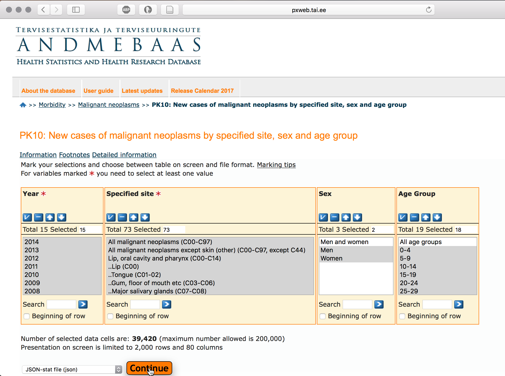
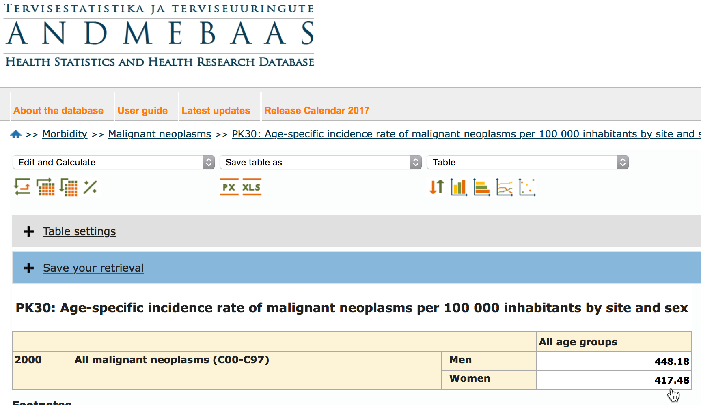

```{r setup, include=FALSE}
knitr::opts_chunk$set(echo = TRUE, dev = 'svg')
```

# Introduction

Cancer and specially lung cancer is becoming one of the leading causes of mortality.
In year 2012. cancer claimed 8.2 million lives worldwide, European Union had 15% share (1.27 million).
Most cancer deaths are caused by lung-, liver-, stomach-, colorectal-, and breast cancer. 
Most frequent cancer types are different in females and males.
Predictions show that cancer incidence increases from 14 million in 2012. to 22 million in 2030-ties.

Vähkkasvajad on maailmas üks juhtivatest surma põhjustatavatest haigustest, nõudes 8.2 miljonit elu 2012. aastal, sealhulgas on EU-27 osakaal 2012. aastal 1.27 miljonit ehk 15%.
Kopsu-, maksa-, mao-, kolorektaal- ja rinnakasvajad põhjustavad enim vähisurmasid.
Sagedasemad vähitüübid on naistel ja meestel erinevad.
Ennustatakse et haigestumus suureneb maailmas 14 miljonilt 2012. aastal 22 miljonini 2030-ndatel.


<br>

# EDA
Exploratory data analysis is iterative process [@wickham2017r] where you:

1. Generate questions about your data.

2. Search for answers by visualising, transforming, and modelling your data.

3. Use what you learn to refine your questions and/or generate new questions.

Andmeanalüüs on iteratiivne protsess, kus:

1. Esitatakse esialgsed küsimused millele soovitakse antud andmete põhjal vastuseid;

2. Proovitakse neile küsimustele vastuseid leida, kasutades andmete visualiseerimit, transformeerimist ja modelleerimist;

3. Andmete põhjal saadud uute teadmiste najal täpsustatakse esitatavaid küsimusi ja tekivad uued küsimused [@wickham2017r].

## Questions
By using cancer incidence data from Estonian Cancer Registry we want to understand:

1. What is the cancer incidence trend in Estonia?

2. What are the most frequent cancer sites?

3. What is the most frequent cancer type in men and in women?

<br>


> When doing data analysis 80% of time will be spent on data wrangling where you also become familiar with your dataset. So it's time well spent.


You must be aware that when looking at your data and searcing for something interesting is multiple hypothesis testing and you need to adjust your expectations.


## Cancer data from Estonian cancer registry
Estonian cancer registry data is available via [Health statistics and health research database](http://pxweb.tai.ee/PXWeb2015/pxweb/en/02Haigestumus/02Haigestumus__04Pahaloomulised%20kasvajad/?tablelist=true&rxid=279523e2-1ea1-4a02-920b-f85bb19a908d).
We are using cancer incidence dataset from table "PK10: New cases of malignant neoplasms by specified site, sex and age group".

Detailed information about variables in this dataset can be found from [here](http://pxweb.tai.ee/PXWeb2015/Resources/PX/Databases/02Haigestumus/04Pahaloomulised%20kasvajad/PKinfo_en.htm).

<br>

```{r,echo=FALSE, fig.cap="Screen caption from dataset download page. Note that data was downloaded in JSON format.", out.width=600}

```

<br>

For your convenience, we have downloaded this dataset into ["rstats-tartu/datasets"](https://github.com/rstats-tartu/datasets) GitHub repo. 

<br>

## Create RStudio project 
Create RStudio project from GitHub repo. 
*First*, create GitHub repo and call it `eda_demo`. 
*Second*, clone this repo into RStudio project. 
Detailed instructions can be found [here](https://rstats-tartu.github.io/createrstudioprojectfromgithub/).

<br>

## Download cancer incidence dataset from GitHub
Download "cancer_incidence_PK10.json" file from "rstats-tartu/datasets" GitHub repo: 
```{r}
url <- "https://raw.githubusercontent.com/rstats-tartu/datasets/master/cancer_newcases_PK10.json"
dir.create("data")
download.file(url, "data/cancer_newcases_PK10.json")
```


<br>

## Import and prepare data

First we load "tidyverse" library. We are going to need also "stringi" and "stringr" libraries for string manipulation (you guess correctly, stringr is based on stringi).
"broom" package converts S3 model object into dataframes for tidy handling.
```{r, message=FALSE}
library(tidyverse)
library(stringi)
library(stringr)
```


Then we import dataset using `json_to_df()` function from "boulder" library. 

You can **install "boulder" from GitHub** "[tpall/boulder](https://github.com/tpall/boulder)":
"boulder" package has few helper functions and was created to work specificly with Estonian Health Statistics and Health Research Database.
However, "boulder" package is still under development and you should use it carefully.

Install "boulder" package if not installed, you need also "devtools" library to install package from GitHub:
```{r}
# install.packages("devtools")
if(!"boulder" %in% installed.packages()){
devtools::install_github("tpall/boulder")
  }
```

## Import dataset
```{r}
library(boulder)
incidence <- json_to_df("data/cancer_newcases_PK10.json")
incidence
```

We have columns "Year", "Specified site", "Sex", age groups from "0-4" to "85 and older", "label", "source", "update". 

"Specified site" indicates the anatomical site of the cancer followed by ICD-10 code in parentheses (there is ICD-10 code for "Burned when water skis caught on fire:  Y91.07XA" or "V97.33XD Sucked into jet engine, subsequent encounter").

For better overview let's filter out "Specified site" values that are longer than 30 characters.
```{r}
filter(incidence, str_length(`Specified site`) < 30)
```

**Year, `Specified site` and Sex are factors.** 
We convert Year to numeric and "Specified site" and Sex to character using `parse_` functions from "readr" package.
```{r}
## Year to numeric
incidence <- incidence %>% mutate_at("Year", parse_number)
## Site and Sex to character
incidence <- incidence %>% mutate_at(c("Specified site", "Sex"), parse_character)
incidence
```

<br>

>We can see that number of new cancer cases is available from years `r paste(range(incidence$Year), collapse = " to ")` for both sexes, `r sum(str_detect(colnames(incidence), "^[[:digit:]]"))` age groups and 
`r length(unique(incidence["Specified site"]))` different types of cancer sites ...

**Hold on...** This table has data intermingled with summary data -- cases of specific cancer types are next to total cases -- , that's bad! 

``` r
Year  Site                              Sex
<fctr><fctr>                            <fctr>
2000	All malignant neoplasms (C00-C97)	Men	    <- tallies
2000	All malignant neoplasms (C00-C97)	Women	  <- tallies
2000	All malignant neoplasms except skin (other) (C00-C97, except C44)	Men	<- tallies
2000	All malignant neoplasms except skin (other) (C00-C97, except C44)	Women	<- tallies
2000	Lip, oral cavity and pharynx (C00-C14)	Men	<- tallies
2000	Lip, oral cavity and pharynx (C00-C14)	Women	<- tallies
2000	..Lip (C00)	Men	
2000	..Lip (C00)	Women	
2000	..Tongue (C01-02)	Men	
2000	..Tongue (C01-02)
```

Summaries are provided for different range of **ICD10** codes e.g. "(C00-C97)" covers all types of cancer.

Here we are not going to do fix this, but we must keep this in mind when summarising data.

Additionally, **we have three metadata columns** in dataset called "label", "source" and "updated".

- Variable "label" says what the values are, 
- "source" gives us info about data origin and 
- "updated" is the date of the last update.


Because these three seem to be constants in our table, we want to place them into separate objects for later use in plot annotation.

```{r}
## keep label and source in a separate variables
label <- unique(incidence$label)
data_source <- unique(incidence$source)
updated <- unique(incidence$updated)
label
data_source
updated
```

Table metadata shows that values are **`r tolower(label)`** and originate from **`r data_source`** and were last time updated in **`r format.Date(updated)`**.

We also want to trim those offending dots from beginning of "Specified site" names and rename "Specified site" into something more convenient, like "Site". 

We use `stri_trim_left()` from "stringi" to trim all characters from the beginning of strings **until first alphabetic character** (`?regex`).
Finally, to exclude table metadata constants, we use `select()` from "dplyr". 
```{r}
## Trim characters from `Specified site` until first [[:alpha:]], 
## we rename `Specified site` and constant columns from table
incidence <- mutate(incidence, 
                Site = stri_trim_left(`Specified site`, "[[:alpha:]]")) %>% 
  select(-`Specified site`, -label, -source, -updated)
```


>Table is in the wide format, we want to convert it into long/tidy format and filter out missing data.

**Reshape data**.
Values are in the age group columns.
We try to reshape table such as the age groups go into "age" column and values will be in the column called "cases".
We use `gather()` from "tidyr" library to bring age group values into one column and cases values into the other.
Here we also need to supply the names of the value columns, otherwise `gather()` will put all categorical variables into the key column and all numeric values into value column.

```{r}
## Let's look what happens when we run gather on our data
gather(incidence)
```
Not what we want!


> It might not be always clear what `gather()` result will look like, you might need several iterations to get expected result.


**Select columns cleverly**.
Cancer cases data is in the age groups columns are labelled from `0-4` to `85 and older`, we need to supply the names of these columns to `gather()`.


We can do this by supplying the names of all 18 age group columns to function (risking with typos and we need to backquote these names because of dash characters) or we can **do this in the smart way**.


"dplyr" has **select helper functions** `?select_helpers` to select columns based on patterns in their names.


One such function is `matches()`: matches a regular expression (`?regex`).
Here we need to match columns with numbers in their names.
Regular expression matching zero or more numbers is `"[[:digit:]]+"`.

Let's run test first using character vector of column names:
```{r}
colnames(incidence)
colnames(incidence) %>% matches("[[:digit:]]+", vars = .)
```

We can see that "[[:digit:]]+" matches columns 4 to 21. Seems like it works!

Here we use `gather()` to collect age group columns selected by `matches("[[:digit:]]+")` into columns "age" and "cases".
```{r}
## Values are in the age group columns
incidence_long <- gather(data = incidence, 
                         key = "age", 
                         value = "cases", 
                         matches("[[:digit:]]+"))
incidence_long
```

Now we have each value on separate row and can filter out missing values. Currently missing values are explicitly labeled with NA-s.
Function `complete.cases()` gives logical vector indicating rows with no missing values (no NA-s).
Based on this logical vector, `filter()` then keeps only `TRUE` rows.
```{r, echo=FALSE}
beforefilter <- nrow(incidence_long)
```


```{r}
## Filter out missing data,
incidence_long <- incidence_long %>% filter(complete.cases(.))
## above is same as:
## filter(cases_long, complete.cases(cases_long))
## omit.na(incidence_long)
```

Before filtering missing values table had `r beforefilter` rows and after `r nrow(incidence_long)`. 
**Looks that we don't have any NA in our table!**

That's all with data wrangling for now!

## Cancer trend in Estonia

It's quite simple, we have already summary data available in our table under variable called "All malignant neoplasms (C00-C97)" in Site column.
We plot this variable versus Years and for begginning we lump together men and women:.

```{r}
total_cases_per_year <- incidence_long %>% 
  filter(Site == "All malignant neoplasms (C00-C97)") %>% 
  group_by(Year) %>% 
  summarise(total_cases = sum(cases))
total_cases_per_year
```

```{r}
## We direct plot to an object, then we can reuse it
p <- total_cases_per_year %>% 
  ggplot(aes(Year, total_cases)) +
  geom_point() +
  geom_line() +
  ylab(str_wrap(label, width = 40)) +
  ggtitle("All malignant neoplasms (C00-C97)",
          subtitle = paste("Source:", data_source))
p
```

We can see that cancer cases are skyrocketing.

To better examplify this trend, we can add linear model fit to the plot using `geom_smooth()` function from "ggplot2".
It is also good idea to start y-axis from 0 in order to decrease lie factor -- we might perceive trend larger than it actually is.

We created ggplot object "p" in the previous code chunk, we can modify this ggplot object by adding new geoms:
```{r}
p + 
  geom_smooth(method = "lm", se = FALSE) + 
  expand_limits(y = 0)
```

Ok, trend is increasing, but how much increase have we seen compared 2014 to 2000?

```{r}
total_cases_per_year %>% 
  filter(Year %in% c(2000, 2014)) %>% 
  knitr::kable(col.names = c("Year", "Number of total cases"))
```

How many percent?

```{r}
total_cases_per_year %>% 
  filter(Year %in% c(2000, 2014)) %>% 
  summarise(perc_increase = sprintf("%1.0f%%", (1 - total_cases[Year==2000]/total_cases[Year==2014])*100))
```


**Is the number of cases similar in males and females?**
Again, we look on the all types of cancer, but split dataset by Sex:

```{r}
## summarise data per Year and Sex
total_cases_per_year_sex <- incidence_long %>% 
  filter(Site == "All malignant neoplasms (C00-C97)") %>% 
  group_by(Year, Sex) %>% 
  summarise(total_cases = sum(cases)) 
## Plot this new summary
total_cases_per_year_sex %>% 
  ggplot(aes(Year, total_cases, color = Sex)) +
  geom_point() +
  geom_line() +
  ylab(label) +
  ggtitle("All malignant neoplasms (C00-C97)",
          subtitle = paste("Source:", data_source))
```

We can see that cancer prevalence seems to be similar in both gender -- the number of female and male cancer patients is similar.
We might have some prior information, that there are more women than men in population.
The question arises whether men and women still get cancer at the same rate?

So we have seen increasing numbers of new cases each year during 2000 and 2014.
Do we have more cancer or does this reflects increase in population size?

To answer these question, we need population size normalised values of cancer cases -- **incidence**.
Cancer incidence is obtained by dividing cancer prevalence with population size.


**incidence = (number of cases / mean annual population) * 100000**

Vähi intsidents on uute mingit tüüpi vähijuhtude arv aastas vastavas populatsioonis.
Uute juhtude arv võib sisaldada mitmeid ühelt patsiendilt leitud primaarseid vähikoldeid. 
Primaarne vähisait on see kustkohas see vähk algselt on tekkinud, mitte metastaas. 
Intsidents ei sisalda tagasi tulnud vähke. 
Populatsiooni suurus sõltub missugusele kasvajale või kasvajagrupile intsidentsi arvutatakse. 
Kui näiteks arvutatakse emakakaela vähi intsidentsi, siis kasutatakse ainult naiste populatsiooni suurust.

Vanusrühmade suuruse suhtes kaalutud intsidents ehk vanuskordajad arvutatakse kaalutud keskmise meetodil, kus kaalud saadakse vanuserühmade suurusest.


## Vanuserähmade suuruse suhtes kaalutud vähi intsidents

Vähi vanuskordajate arvutamiseks on meil puudu populatsioonisuurused.

We obtained mean annual population data from Statistics Estonia.
You can download this dataset from "[rstats-tartu/datasets](https://github.com/rstats-tartu/datasets)" repo.

Download population data into our projects "data" subfolder:
```{r, message=FALSE}
if(!file.exists("data/mean_annual_population.csv")){
  download.file("https://raw.githubusercontent.com/rstats-tartu/datasets/master/mean_annual_population.csv", "data/mean_annual_population.csv")
}
```

Import mean annual population data.

```{r}
## Read in data
pop <- read_csv("data/mean_annual_population.csv")
pop
```

We can see that population size data is in wide format and we have separate columns for age groups "0" and "1-4" that we don't have in our cancer data.
In cancer data we have age group "0-4" instead.

We need to summarise age groups "0" and "1-4" into "0-4", drop "0" and "1-4" and then convert table to long format using `gather()`.
```{r}
## Summarise 0 and 1-4 to 0-4 age group, keep only the latter
pop_long <- mutate(pop, "0-4" = `0` + `1-4`) %>% 
  select(-`0`, -`1-4`) %>% 
  gather("age", "ave_pop", matches("^[[:digit:]]"))
pop_long
```

Merge cancer cases with population size data. Note that population values only from years 2000 to 2014 will be merged to incidence_long.
```{r}
incidence_long <- left_join(incidence_long, pop_long)
incidence_long
```

Cancer incidence is presented as new cases per 100'000.
Now we have number of new cases and population size side-by-side and can go on to calculate cancer incidence per 100'000 inhabitans:
```{r this}
incidence_year_sex <- incidence_long %>% 
  group_by(Site, Year, Sex) %>% 
  summarise(cases = sum(cases),
            ave_pop = sum(ave_pop)) %>% 
  mutate(incidence = (cases / ave_pop) * 100000)
## we selected less columns for viewing
select(incidence_year_sex, Site, Year, incidence, everything())
```

Let's see if we got correct number by comparing our incidence numbers to ones published in [Estonian Health Statistics database]( http://pxweb.tai.ee/PXWeb2015/pxweb/en/02Haigestumus/02Haigestumus__04Pahaloomulised%20kasvajad/PK30.px/table/tableViewLayout2/?rxid=99c3b4bb-c5a7-466d-9f66-2744870afcd7):


```{r}
incidence_year_sex %>% 
  filter(Site == "All malignant neoplasms (C00-C97)",
         Year == 2000) %>% 
  select(-Site, -cases, -ave_pop) %>% 
  knitr::kable()
```

<br>

```{r, echo = FALSE, out.width=600, fig.cap="Cancer incidence values of All malignant neoplasms for year 2000 in Estonian Health Statistics database."}

```

<br>

>Seems that we are calculating cancer incidence similarly as professional statisticians.

<br>

**Men get more cancer in Estonia.** 
Clearly, increasing trend for new cancer cases is still visible after normalisation for population size. 
However, incidence uncovers another important trend, namely, men tend to get more cancer than women in Estonia.
While the number of cases per year was similar in men and women, the incidence is higher in men:
```{r}
total_incidence_year_sex <- incidence_year_sex %>% 
  filter(Site == "All malignant neoplasms (C00-C97)")
## we give new data to plot and we also must supply aes for Sex
total_incidence_year_sex %>% 
  ggplot(aes(Year, incidence, color = Sex)) +
  geom_point() +
  geom_line() +
  ylab("Cancer incidence per 100'000") +
  ggtitle("All malignant neoplasms (C00-C97)",
          subtitle = paste("Source:", data_source))
```

Is increasing incidence trend comparable to the increase in number of cases? 
We can try to look at this by calculating percent increase in 2014 compared to 2000.
```{r, echo=FALSE}
## here we use again min and max as proxies to year 2000 and 2014, respectively
incidence_range <- total_incidence_year_sex %>%
  filter(Year %in% c(2000, 2014)) %>% 
  group_by(Sex) %>%
  summarise(increase = sprintf("%1.0f%%", (1 - incidence[Year=="2000"] / incidence[Year=="2014"]) * 100))
knitr::kable(incidence_range, col.names = c("Sex", "Increase"))
```

We can see that compared to counts of new cases both men and women show even bigger increase in cancer rates in Estonia. 
Do we get more cancer or do we diagnose more cancer... ?

>We can settle that cancer trend in Estonia is worryingly increasing.

## What are the most frequent cancer sites?

Let's have a look at Top10 most frequent cancers.
Most frequent cancers are different in men and women.

First, we try to remove some summary variables from table.
"boulder" package has *adhoc* function `icd_sums()` that tries to id rows that contain summary data over many cancer sites using ICD codes in "Sites" strings.
```{r}
## boulder has adhoc function that tries to id parent Sites
parent_nodes <- boulder::icd_sums(unique(incidence_long$Site))
parent_nodes
```

Create vector for subsetting:
```{r}
unique_parents <- unique(parent_nodes$Parent)
```

> This can be also achieved by "manually" specifying Site values to be omitted.

## Find most frequent cancer sites
We calculate incidence for each Site per Sex, let's drop Year by taking its average:
```{r}
incidence_sex_filt <- incidence_year_sex %>% 
  filter(!Site %in% unique_parents) %>% 
  group_by(Site, Sex) %>% 
  summarise(incidence = mean(incidence))
incidence_sex_filt
```

List of top10 cancers by Sex:
```{r}
## list of top10 cancers
listof_top10 <- incidence_sex_filt %>% 
  group_by(Sex) %>% 
  top_n(10, incidence) %>% 
  arrange(desc(incidence))
listof_top10
```

Plot most frequent cancers:
```{r}
incidence_sex_filt %>% 
  filter(Site %in% listof_top10$Site) %>% 
  ggplot(aes(Sex, incidence)) +
  geom_bar(stat = "identity") + ## use the values that we have in our table
  facet_wrap(~ Site, labeller = label_wrap_gen(width = 20)) +
  labs(title = "Top10 cancer sites from both genders",
       subtitle = "Mean annual incidence from years 2000 to 2014",
       y = "Cancer incidence per 100000",
       caption = paste("Source:", data_source)) +
  theme(axis.title.x = element_blank())
```

Here is another take using the same data:
```{r}
incidence_sex_filt %>%
  filter(Site %in% listof_top10$Site) %>% 
  ggplot(aes(reorder(Site, incidence), incidence, fill = Sex)) +
  geom_bar(stat = "identity") +
  labs(y = "Cancer incidence per 100000",
       title = "Top10 cancer sites from both genders",
       subtitle = "Mean annual incidence from years 2000 to 2014",
       caption = paste("Data:", data_source)) +
  coord_flip() +
  theme(axis.title.y = element_blank(),
        legend.title = element_blank()) +
  scale_fill_manual(values = c("darkgray", "orange"))
```

What these two graphs tell us?

## Cancer takes whole life to develop
Which age groups get most cancer? Number of new cases versus incidence.

First, we also make age groups numeric for correct x-axis order.
```{r}
numeric_agegroup <- function(x) parse_number(str_extract(x, "^[0-9]{1,2}"))
incidence_long <- incidence_long %>% mutate_at("age", numeric_agegroup)
incidence_long
```


Let's plot cancer incidence versus age groups.
```{r}
p <- incidence_long %>% 
  filter(Site %in% listof_top10$Site) %>%
  mutate(incidence = (cases / ave_pop) * 100000) %>% 
  group_by(Sex, Site, age) %>% 
  summarise(incidence = mean(incidence)) %>% 
  ggplot(aes(age, incidence, color = Sex)) +
  geom_line() +
  facet_wrap(~ Site, labeller = label_wrap_gen(20), scales = "free_y") +
  scale_color_manual(values = c("darkgray", "orange"))
p
```
We can see that generally cancer incidence peaks at the age of 60+. 
There are exeptions, like cervical cancer which has peak incidence in 40 year olds.

Cancer incidence increases with age: use log on x and y axis!
```{r}
incidence_long %>% 
  filter(Site %in% listof_top10$Site) %>%
  mutate(incidence = cases / (ave_pop/1E5)) %>% 
  group_by(Sex, Site, age) %>% 
  summarise(incidence = mean(incidence)) %>% 
  mutate_at(vars(age, incidence), log) %>% 
  filter(is.finite(incidence), is.finite(age)) %>% 
  ggplot(aes(age, incidence, color = Sex)) +
  geom_point() +
  facet_wrap(~ Site, labeller = label_wrap_gen(20), scales = "free_y") +
  scale_color_manual(values = c("darkgray", "orange")) +
  geom_smooth(method = "lm")
```

There are cancer that show linear relationship between age and incidence, like skin cancer and bladder cancer.
And there are cancers that initially show increase but then reach plateau, these seem to be mostly gender specific cancers like breast cancer, cervical cancer, and endometrial cancer in women and prostate cancer in men.
If you compare breast cancer in women and men, then it seems that they have different mechanism...

## Weighted averages
Previous calculation we summarised all age groups to calculate cancer total population incidence.
However, age groups in population are of different size and different cancer prevalence. 

Let's try to take into account age-dependent differences in population size when calculating incidence -- by population size as weight.

Plot population sizes of different age groups:
```{r}
## install.packages("viridis")
library(viridis)
## Plot age group differences
incidence_long %>% 
  ungroup() %>% 
  select(Year, age, Sex, ave_pop) %>%
  distinct() %>% 
  ggplot(aes(age, ave_pop, color = Sex, group = Sex)) +
  geom_jitter(jitter = 0.1) +
  geom_smooth(method = "loess", se = FALSE) +
  labs(title = "Population sizes of different age groups in Estonia",
       subtitle = "Years 2000 to 2014",
       caption = "Data: Statistics Estonia.",
       y = "Mean annual population",
       x = "Age groups") +
  scale_color_viridis(discrete = TRUE)
```


Let's calculate age group size weighted incidence values. 
For comparison, first we recalculate raw incidence and then age-weighted incidence.
To calculate raw incidence, we first sum up all cases and population size over age groups.
Then we drop Year by calculating mean incidence across years.
```{r}
## raw incidence
raw_incidence <- incidence_long %>% 
  group_by(Year, Site, Sex) %>% 
  summarise(cases = sum(cases),
            ave_pop = sum(ave_pop)) %>% 
  mutate(incidence = (cases / ave_pop) * 100000) %>% ## incidence
  group_by(Site, Sex) %>% 
  summarise(incidence = mean(incidence),
            ave_pop = mean(ave_pop))
raw_incidence
```

In order to calculate age-weighted incidence we should follow diferent logic.
Here we start by calculating incidence for each data split in our table: Year, Site, Sex, age.
Then we go on and calculate mean incidence and average pop size across Years.
Then we apply weights and calculate weighted average.

```{r}
## Age weighted incidence
age_weighted_incidence <- incidence_long %>% 
  mutate(incidence = (cases / ave_pop) * 100000) %>% ## incidence
  group_by(Site, Sex, age) %>% ## calculate mean population size and mean incidence across years
  summarise(incidence = mean(incidence), 
            ave_pop = mean(ave_pop)) %>% 
  mutate(wt = ave_pop / sum(ave_pop), ## calculate and apply weights
         incidence = wt * incidence) %>% 
  summarise(incidence = sum(incidence), ## calulate weighted average
            ave_pop = sum(ave_pop))
age_weighted_incidence
```

Plot results side by side.
```{r}
library(viridis)
bind_rows(list(raw_incidence, age_weighted_incidence), .id = "type") %>% 
  filter(Site %in% listof_top10$Site) %>%
  ggplot(aes(Sex, incidence, fill = type)) +
  geom_bar(stat = "identity", position = "dodge") +
  facet_wrap(~ Site, labeller = label_wrap_gen(20), scales = "free_y") +
  scale_fill_viridis(discrete = TRUE, labels = c("Raw", "Age-\nweighted"), "Incidence") +
  labs(y = "Cancer incidence per 100,000",
       title = "Top10 cancer sites from both genders",
       subtitle = "Mean annual incidence from years 2000 to 2014",
       caption = paste("Data:", data_source))
```

As can be seen, these values are in our case virtually similar.

