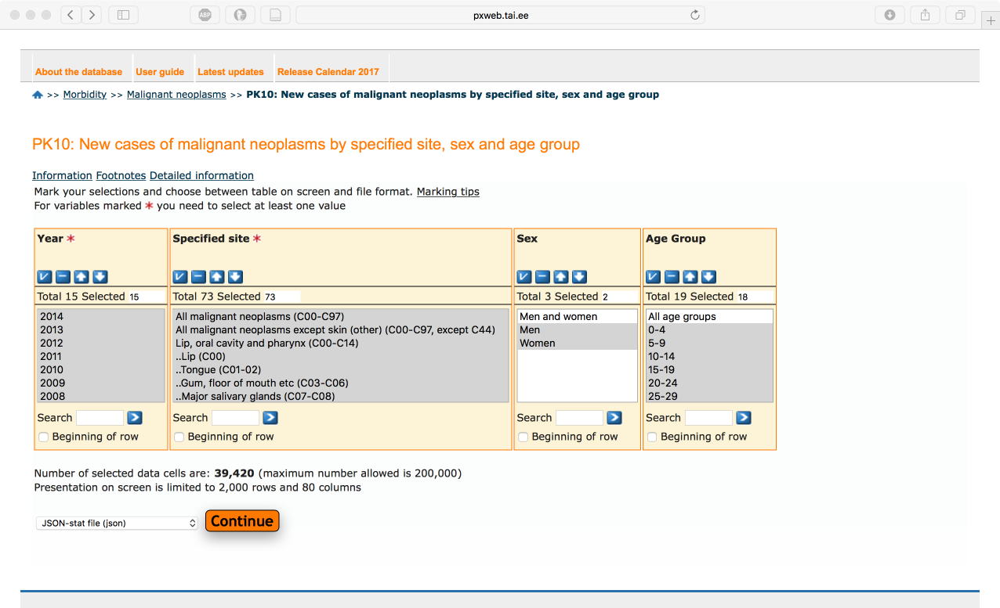

```{r setup, include=FALSE}
knitr::opts_chunk$set(echo = TRUE)
```

## Introduction

Cancer and specially lung cancer is becoming one of the leading causes of mortality.
In year 2012. cancer claimed 8.2 million lives worldwide, European Union had 15% share (1.27 million).
Most cancer deaths are caused by lung-, liver-, stomach-, colorectal-, and breast cancer. 
Most frequent cancer types are different in females and males.
Predictions show that cancer incidence increases from 14 million in 2012. to 22 million in 2030-ties.

Vähkkasvajad on maailmas üks juhtivatest surma põhjustatavatest haigustest, nõudes 8.2 miljonit elu 2012. aastal, sealhulgas on EU-27 osakaal 2012. aastal 1.27 miljonit ehk 15%.
Kopsu-, maksa-, mao-, kolorektaal- ja rinnakasvajad põhjustavad enim vähisurmasid.
Sagedasemad vähitüübid on naistel ja meestel erinevad.
Ennustatakse et haigestumus suureneb maailmas 14 miljonilt 2012. aastal 22 miljonini 2030-ndatel.

## EDA
Exploratory data analysis is iterative process [@wickham2017r] where you:

1. Generate questions about your data.

2. Search for answers by visualising, transforming, and modelling your data.

3. Use what you learn to refine your questions and/or generate new questions.

Andmeanalüüs on iteratiivne protsess, kus:

1. Esitatakse esialgsed küsimused millele soovitakse antud andmete põhjal vastuseid;

2. Proovitakse neile küsimustele vastuseid leida, kasutades andmete visualiseerimit, transformeerimist ja modelleerimist;

3. Andmete põhjal saadud uute teadmiste najal täpsustatakse esitatavaid küsimusi ja tekivad uued küsimused [@wickham2017r].

## Questions
By using cancer incidence data from Estonian Cancer Registry we want to understand:

1. What is the cancer incidence trend in Estonia?

2. What are the most frequent cancer sites?

3. What is the most frequent cancer type in men and in women?

## Cancer incidence data from Estonian cancer registry
Estonian cancer registry data is available via [Health statistics and health research database]( http://pxweb.tai.ee/PXWeb2015/pxweb/en/02Haigestumus/02Haigestumus__04Pahaloomulised%20kasvajad/?tablelist=true&rxid=279523e2-1ea1-4a02-920b-f85bb19a908d).
We are using cancer incidence dataset from table "PK10: New cases of malignant neoplasms by specified site, sex and age group".

Detailed information about variables in this dataset can be found from [here](http://pxweb.tai.ee/PXWeb2015/Resources/PX/Databases/02Haigestumus/04Pahaloomulised%20kasvajad/PKinfo_en.htm).

```{r,echo=FALSE, fig.cap="Screen caption from dataset download page. Note that data was downloaded in JSON format."}

```
For your convenience, we have downloaded this dataset into ["rstats-tart/datasets"](https://github.com/rstats-tartu/datasets) GitHub repo. 


## Create RStudio project 
Create RStudio project from GitHub repo. First create GitHub repo and call it `eda_demo`. Further instructions can be found [here](https://rstats-tartu.github.io/createrstudioprojectfromgithub/).


## Download PK10 data from GitHub
Download "cancer_incidence_PK10.json" file from "rstats-tartu/datasets" GitHub repo: 
```{r, eval=FALSE}
url <- "https://raw.githubusercontent.com/rstats-tartu/datasets/master/cancer_incidence_PK10.json"
dir.create("data")
download.file(url, "data/cancer_incidence_PK10.json")
```

## Import and prepare data

First we download `tidyverse` library:
```{r, message=FALSE}
library(tidyverse)
```


Download dataset from "rstats-tartu/datasets" GitHub repo:
```{r}
url <- "https://raw.githubusercontent.com/rstats-tartu/datasets/master/cancer_incidence_PK10.json"
dir.create("data")
download.file(url, "data/cancer_incidence_PK10.json")
```


Then we 

```{r}
# devtools::install_github("tpall/boulder")
library(boulder)
path <- "data/cancer_incidence_PK10.json"
incidence <- json_to_df(path)
incidence
```

This table has data intermingled with summary data, that's bad! 
```
Year  Specified site  Sex
<fctr><fctr>          <fctr>
2000	All malignant neoplasms (C00-C97)	Men	    <- tallies
2000	All malignant neoplasms (C00-C97)	Women	  <- tallies
2000	All malignant neoplasms except skin (other) (C00-C97, except C44)	Men	<- tallies
2000	All malignant neoplasms except skin (other) (C00-C97, except C44)	Women	<- tallies
2000	Lip, oral cavity and pharynx (C00-C14)	Men	<- tallies
2000	Lip, oral cavity and pharynx (C00-C14)	Women	<- tallies
2000	..Lip (C00)	Men	
2000	..Lip (C00)	Women	
2000	..Tongue (C01-02)	Men	
2000	..Tongue (C01-02)
```
We need first to identify and remove summary data from this table. 
Data rows follow the summary data rows and can be identified by two dots `..` in the beginning of the variable name. 
We want to keep summary data ids in the table in a separate column.
```{r}
# We have two metadata columns for our dataset
## Because these two don't chance in our table, 
## let's keep label and source in a separate variable
label <- unique(incidence$label)
data_source <- unique(incidence$source)

## Filter out summary rows and exclude table metadata
incidence_filt <- filter(incidence, !summary_var(`Specified site`)) %>% 
  select(-label, -source)
```

Data is still in wide format, let's convert table into long/tidy format and filter out missing data.
```{r}
## Values are in the age group columns
incidence_long <- gather(incidence_filt, "age", "incidence", matches("^[[:digit:]]+"))

## Filter out missing data,
incidence_long <- incidence_long %>% filter(complete.cases(.)) %>% as_data_frame()
```


Let's have a look at the dataset structure:
```{r}
colnames(incidence_long)
```


## Bibliograafia
